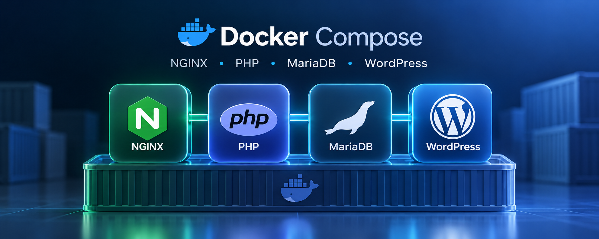

# Yüksek Performanslı WordPress Stack

Bu depo, yüksek trafik için ayarlanmış bir WordPress altyapısını üç Compose varyantıyla sunar. Nginx önde, PHP-FPM arkada, veritabanı olarak MariaDB, nesne önbelleği olarak Redis çalışır. Tüm yapılandırma ilgili compose dosyasının içine gömülüdür.

- `docker-compose.yml` herhangi bir Docker sunucusunda, Traefik veya Dokploy varsaymadan çalışır.
- `docker-compose-lokal.yml` yerel geliştirme içindir.
- `docker-compose-dokploy.yml` Dokploy üzerinde Traefik label'larıyla çalışır.

## İçindekiler

1. [Genel bakış](#genel-bakış)
2. [Mimari](#mimari)
3. [Bileşenler ve sürümler](#bileşenler-ve-sürümler)
4. [Gereksinimler](#gereksinimler)
5. [Compose varyantları](#compose-varyantları)
6. [Kurulum](#kurulum)
7. [Ortam değişkenleri](#ortam-değişkenleri)
8. [Yapılandırmanın ayrıntıları](#yapılandırmanın-ayrıntıları)
9. [Cloudflare ayarları](#cloudflare-ayarları)
10. [RAM'e göre ölçekleme](#rame-göre-ölçekleme)
11. [Güvenlik](#güvenlik)
12. [Yedekleme ve geri yükleme](#yedekleme-ve-geri-yükleme)
13. [Güncelleme](#güncelleme)
14. [Sorun giderme](#sorun-giderme)

## Genel bakış

Hedef, ziyaretçi isteklerinin büyük bölümünü PHP ve veritabanına hiç uğramadan karşılamaktır. Bunun için üç katmanlı bir önbellek zinciri kullanılır:

1. **Cloudflare (turuncu bulut):** Statik dosyaları ve isteğe bağlı olarak HTML'i kullanıcıya en yakın noktadan sunar.
2. **Nginx FastCGI cache:** Anonim ziyaretçilerin sayfalarını RAM üzerinde tutar. Önbellekteki bir sayfa PHP çalıştırılmadan döner.
3. **Redis nesne önbelleği:** Önbelleği aşan isteklerde (giriş yapmış kullanıcı, yönetim paneli, sepet) veritabanı sorgularının sonuçlarını bellekte saklar.

Bunlara ek olarak PHP tarafında OPcache ve JIT, veritabanı tarafında InnoDB ayarları devrededir.

## Mimari

```
Ziyaretçi
   |
Cloudflare (isteğe bağlı: CDN, WAF, TLS)
   |
TLS sonlandırıcı veya doğrudan port
   |  Dokploy varyantı: Traefik (Let's Encrypt). nginx port yayınlamaz.
   |  Evrensel: nginx, host portu HTTP_PORT (varsayılan 80)
   |  Yerel: nginx, host portu HTTP_PORT (varsayılan 8080)
nginx  ----------------------------  FastCGI cache (RAM, tmpfs)
   |
wordpress (PHP-FPM 8.5 + OPcache/JIT + phpredis)
   |                     |
mariadb (12.3 LTS)     redis (8)

cron: WP-Cron'u her dakika çalıştıran yardımcı konteyner
```

Dokploy varyantında dışarıya yalnızca Traefik açılır; `nginx` port yayınlamaz, Docker iç ağında 80'i `expose` eder. Evrensel varyant 80'i (veya `HTTP_PORT`), yerel varyant 8080'i yayınlar. Veritabanı ve Redis her varyantta dış dünyaya kapalıdır.

## Bileşenler ve sürümler

| Servis | İmaj | Görevi |
|---|---|---|
| `nginx` | `nginx:alpine` | Ters vekil, statik dosya sunumu, FastCGI cache |
| `wordpress` | `wordpress:php8.5-fpm-alpine` (phpredis eklenerek derlenir) | WordPress 7.1 ve PHP 8.5 |
| `cron` | `wordpress:cli-php8.5` | WP-CLI ile zamanlanmış görevleri çalıştırır |
| `mariadb` | `mariadb:12.3` | Veritabanı (LTS sürüm) |
| `redis` | `redis:8-alpine` | Nesne önbelleği |

`wordpress` servisi hazır bir imaj çekmez, `dockerfile_inline` ile resmi imajın üzerine **phpredis** eklentisini ekleyerek derlenir. Bu sayede Redis ile konuşmak için PHP ile yazılmış yavaş bir istemci yerine yerel C eklentisi kullanılır. İlk dağıtımda derleme birkaç dakika sürebilir.

## Gereksinimler

- Docker ve Docker Compose **2.23 veya üzeri** (`configs.content` özelliği için)
- Evrensel varyant: bir Docker sunucusu ve alan adı. TLS'i kendi reverse proxy'niz veya Cloudflare sonlandırabilir.
- Yerel varyant: Docker çalışan bir makine. Alan adı gerekmez.
- Dokploy varyantı: Dokploy kurulu bir sunucu (dedicated önerilir) ve alan adı
- Cloudflare hesabı üretimde önerilir, zorunlu değildir
- Üretimde yeterli RAM (en az 8 GB, yüksek trafik için 32 GB ve üzeri). Yerel varsayılanlar dizüstü bilgisayara göredir.

Sürümü kontrol etmek için:

```bash
docker compose version
```

## Compose varyantları

Üç dosya aynı servisleri ve aynı performans ayarlarını taşır (FastCGI cache, 404 negatif önbellek, OPcache/JIT, Redis, MariaDB, `wp-login` hız sınırı, cron, phpredis). Fark, nasıl yayınlandıkları ve bellek varsayılanlarıdır.

Aynı anda yalnızca bir varyant çalıştırın. Üç dosyada da proje adı `name: wp` olduğu için volume ve konteyner adları ortaktır; ikisini birden ayağa kaldırmak çakışır.

### docker-compose.yml — evrensel

Herhangi bir Docker sunucusu. Traefik label'ı yoktur. Nginx host portu yayınlar: `${HTTP_PORT:-80}:80`. `DOMAIN` zorunludur; `server_name` ve `WP_HOME` / `WP_SITEURL` (`https://DOMAIN`) bu değişkenden kurulur. Arkada Nginx, Caddy, Traefik dışı bir proxy veya Cloudflare olabilir; doğrudan porta da bağlanabilirsiniz.

```bash
docker compose up -d
```

`-f docker-compose.yml` vermek aynı dosyayı seçer.

### docker-compose-lokal.yml — yerel

Yerel makine. Traefik ve Let's Encrypt yoktur. Nginx `${HTTP_PORT:-8080}:80` yayınlar, böylece 80 numaralı port meşgul edilmez. Site adresi `http://localhost:8080` olur. `DOMAIN` zorunlu değildir; `server_name` varsayılanı `localhost`.

Bellek varsayılanları küçüktür ve ortam değişkeniyle büyütülebilir: nginx tmpfs 256m (önbellek `max_size` 200m), `PHP_MAX_CHILDREN` 8, `DB_BUFFER_POOL` 512M, `REDIS_MAXMEMORY` 256mb. PHP-FPM yedek işçi sayıları da bu tavana sığacak şekilde düşüktür (başlangıç 2, boşta 1–4).

```bash
docker compose -f docker-compose-lokal.yml up -d
```

Tarayıcıda `http://localhost:8080` adresini açın. Şifre vermezseniz yerel varsayılanlar kullanılır (`DB_PASSWORD=localpass`, `DB_ROOT_PASSWORD=localroot`). Bunları üretimde kullanmayın.

### docker-compose-dokploy.yml — Dokploy

Dokploy'a Raw olarak yapıştırılır veya Compose ile çalıştırılır. Host portu yayınlanmaz; nginx yalnızca `expose: ["80"]` eder. Traefik label'ları `Host(DOMAIN)`, `websecure` giriş noktası ve `letsencrypt` sertifika çözücüsü tanımlar.

```bash
docker compose -f docker-compose-dokploy.yml up -d
```

Dokploy panelinde **Domains** sekmesi (Service: `nginx`, Port: `80`, HTTPS: açık, Certificate: Let's Encrypt) aynı yönlendirmeyi kurar. **Label'larla birlikte kullanmayın:** aynı alan adı için iki tanım Traefik'te çakışır. Domains sekmesini tercih ederseniz compose'daki Traefik label'larını kaldırın.

## Kurulum

### Evrensel

1. Örnek ortam dosyasını kopyalayın ve değerleri düzenleyin. `DOMAIN` protokolsüz olmalıdır (örn. `site.com`). Şifreleri mutlaka kendiniz belirleyin.

```bash
cp .env-example .env
```

2. Stack'i ayağa kaldırın:

```bash
docker compose up -d
```

3. TLS'i kendi reverse proxy'niz veya Cloudflare ile sonlandırın. `WP_HOME` ve `WP_SITEURL` `https://DOMAIN` olarak yazılır; proxy `X-Forwarded-Proto: https` iletmelidir.
4. Alan adını tarayıcıda açıp WordPress kurulum sihirbazını tamamlayın.
5. Yönetim panelinden **Redis Object Cache** eklentisini kurun ve **Enable Object Cache** seçeneğini etkinleştirin. Bağlantı bilgisi (`WP_REDIS_HOST`) compose içinde zaten tanımlıdır.

Doğrulama için sayfayı iki kez isteyin ve yanıt başlığına bakın:

```bash
curl -sI https://alanadiniz.com | grep -i x-cache
```

İkinci istekte `X-Cache: HIT` görmeniz gerekir. Doğrudan porta bakıyorsanız `http://sunucu:80` kullanın.

### Yerel

Ortam dosyası zorunlu değildir. `.env-example` üretim boyutundadır (`DB_BUFFER_POOL=16G` gibi); yerelde onu olduğu gibi yüklerseniz küçük varsayılanlar ezilir. Yerel için ya dosyasız çalıştırın ya da aşağıdaki küçük değerleri kullanın.

```bash
docker compose -f docker-compose-lokal.yml up -d
```

Küçük örnek:

```
HTTP_PORT=8080
DB_PASSWORD=localpass
DB_ROOT_PASSWORD=localroot
DB_BUFFER_POOL=512M
PHP_MAX_CHILDREN=8
REDIS_MAXMEMORY=256mb
```

Kurulum sihirbazı `http://localhost:8080` adresindedir. `HTTP_PORT` değiştirirseniz WordPress adresi de aynı porta bağlanır.

### Dokploy

Bu adımlar yalnızca `docker-compose-dokploy.yml` içindir.

1. Dokploy panelinde yeni bir **Compose** servisi oluşturun ve kaynak olarak **Raw** seçin.
2. `docker-compose-dokploy.yml` içeriğini yapıştırın.
3. **Environment** sekmesine [ortam değişkenlerini](#ortam-değişkenleri) girin. `DOMAIN` alanına sitenin alan adını protokolsüz yazın (örn. `site.com`); şifreleri mutlaka kendiniz belirleyin.
4. Yönlendirmeyi iki yoldan biriyle kurun (ayrıntı için bkz. [Traefik yönlendirmesi ve Dokploy Domains](#traefik-yönlendirmesi-ve-dokploy-domains)):
   - **Compose label'ları (varsayılan):** `nginx` servisindeki Traefik label'ları `DOMAIN` üzerinden yönlendirmeyi otomatik kurar, panelde ek ayar gerekmez.
   - **Dokploy Domains sekmesi:** Service: `nginx`, Port: `80`, HTTPS: açık, Certificate: Let's Encrypt. Bu yolu seçerseniz compose'daki Traefik label'larını kaldırın.
5. **Deploy** düğmesine basın.
6. Alan adını tarayıcıda açıp WordPress kurulum sihirbazını tamamlayın.
7. Yönetim panelinden **Redis Object Cache** eklentisini kurun ve **Enable Object Cache** seçeneğini etkinleştirin.
8. Cloudflare'de DNS kaydını turuncu buluta alın ve SSL/TLS modunu **Full (strict)** yapın.

#### Traefik yönlendirmesi ve Dokploy Domains

Dokploy varyantı, `nginx` servisine Traefik label'ları ekler: `Host($DOMAIN)` yönlendirme kuralı, `websecure` giriş noktası, `letsencrypt` sertifika çözücüsü ve 80 numaralı port. Böylece yönlendirme ortam değişkenindeki `DOMAIN` değerinden otomatik kurulur; Dokploy panelinde ayrı bir tanım gerekmez.

Dokploy'un **Domains** sekmesi (Service: `nginx`, Port: `80`, HTTPS: açık, Certificate: Let's Encrypt) aynı işi görür ve alternatif olarak kullanılabilir. **İkisini birden kullanmayın:** aynı alan adı için iki ayrı yönlendirme tanımı Traefik'te çakışır. Dokploy Domains'i tercih ederseniz compose'daki Traefik label'larını kaldırın.

Label'ların çalışması için stack'in Traefik ile ortak bir Docker ağında olması gerekir (Dokploy'un yönettiği proxy ağı gibi).

## Ortam değişkenleri

| Değişken | Varsayılan | Açıklama |
|---|---|---|
| `DOMAIN` | yok (evrensel ve Dokploy'da zorunlu) | Sitenin alan adı (protokolsüz, örn. `site.com`). Nginx `server_name` ve `WP_HOME`/`WP_SITEURL` için kullanılır. Traefik `Host()` kuralı yalnızca Dokploy varyantındadır. Yerelde isteğe bağlıdır; verilmezse `server_name` `localhost` olur |
| `HTTP_PORT` | evrensel `80`, yerel `8080` | Nginx'in host'a yayınladığı port. Dokploy varyantı port yayınlamaz, bu değişken orada kullanılmaz |
| `DB_NAME` | `wordpress` | Veritabanı adı |
| `DB_USER` | `wpuser` | Veritabanı kullanıcısı |
| `DB_PASSWORD` | evrensel/Dokploy: yok (zorunlu). Yerel: `localpass` | Kullanıcı şifresi |
| `DB_ROOT_PASSWORD` | evrensel/Dokploy: yok (zorunlu). Yerel: `localroot` | MariaDB root şifresi |
| `DB_BUFFER_POOL` | evrensel/Dokploy `4G`, yerel `512M` | InnoDB buffer pool boyutu. `.env-example` üretim örneği `16G` yazar |
| `PHP_MAX_CHILDREN` | evrensel/Dokploy `50`, yerel `8` | Aynı anda çalışabilecek PHP-FPM işçi sayısı. `.env-example` üretim örneği `80` yazar |
| `REDIS_MAXMEMORY` | evrensel/Dokploy `1gb`, yerel `256mb` | Redis'in kullanabileceği en fazla bellek. `.env-example` üretim örneği `2gb` yazar |

`.env-example` evrensel ve üretim değerlerini tutar. Yerel küçük örnek bir önceki bölümde.

Üretim örneği:

```
DOMAIN=site.com
# HTTP_PORT=80
DB_NAME=wordpress
DB_USER=wpuser
DB_PASSWORD=GUCLU_SIFRE_1
DB_ROOT_PASSWORD=GUCLU_SIFRE_2
DB_BUFFER_POOL=16G
PHP_MAX_CHILDREN=80
REDIS_MAXMEMORY=2gb
```

> Şifrelerde `$` ve `#` karakterlerini kullanmayın. Compose ve ortam dosyası ayrıştırıcıları bu karakterleri özel yorumlar.

## Yapılandırmanın ayrıntıları

### Nginx

Yapılandırma `nginx_conf` adlı gömülü config içindedir.

**FastCGI cache.** Önbellek `/var/cache/nginx` dizininde tutulur ve bu dizin evrensel ile Dokploy varyantında 2 GB'lık bir `tmpfs` olarak bağlanır. Yani önbellek diske değil RAM'e yazılır. Önbellek alanı 1800 MB ile sınırlıdır, 60 dakika erişilmeyen kayıtlar silinir. Yerel varyantta tmpfs 256 MB, önbellek üst sınırı 200 MB'dir. Başarılı yanıtlar (200, 301, 302) **10 dakika** geçerlidir. 404 yanıtları da negatif önbelleğe alınır ve **1 dakika** tutulur; böylece var olmayan adreslere gelen istek trafiği her seferinde PHP'ye ve veritabanına ulaşmaz. `fastcgi_cache_revalidate` açıktır.

**Önbelleğe alınmayan durumlar.** Aşağıdakilerden biri varsa istek doğrudan PHP'ye gider:

- İstek yöntemi `POST` ise
- URL'de sorgu parametresi varsa
- Çerezlerde `wordpress_logged_in`, `comment_author`, `wp-postpass`, `woocommerce_items_in_cart` veya `woocommerce_cart_hash` varsa
- Adres `/wp-admin`, `/wp-login.php`, `/wp-json`, `/cart`, `/checkout`, `/my-account` veya `/xmlrpc.php` ile başlıyorsa

**Dayanıklılık.** `fastcgi_cache_use_stale` sayesinde PHP hata verirse veya yanıt vermezse eski önbellek sunulmaya devam eder. `fastcgi_cache_background_update` önbelleği arka planda yeniler, `fastcgi_cache_lock` ise aynı sayfa için yığılmayı önler.

**Statik dosyalar.** Görseller, CSS, JS ve yazı tipleri 365 gün süreyle `immutable` olarak önbelleğe alınır. Erişim kaydı tutulmaz.

**Gerçek IP ve HTTPS.** Nginx, özel ağ aralıklarından (`10.0.0.0/8`, `172.16.0.0/12`, `192.168.0.0/16`) gelen isteklerde `CF-Connecting-IP` başlığını gerçek ziyaretçi IP'si olarak kabul eder. Bu kural Dokploy'a özel değildir; Docker köprüsü, kurumsal bir reverse proxy veya Cloudflare için geçerlidir. Dokploy varyantında bu proxy Traefik'tir. İletilen `X-Forwarded-Proto` bilgisi PHP'ye `HTTPS` parametresi olarak geçirilir, böylece sonsuz yönlendirme döngüsü oluşmaz. Yerel varyant düz HTTP ile çalışır; başlık yoksa HTTPS kapalı kabul edilir.

**Güvenlik.** `xmlrpc.php` kapalıdır, nokta ile başlayan gizli dosyalar (`.well-known` hariç) engellenir, sunucu sürüm bilgisi gizlenir. `wp-login.php` istekleri hız sınırına (rate limit) tabidir; kaba kuvvet (brute-force) denemeleri hem güvenlik hem performans açısından sınırlandırılmıştır.

### PHP-FPM ve PHP

| Ayar | Değer | Not |
|---|---|---|
| `pm` | `dynamic` | İşçi sayısı yüke göre değişir |
| `pm.max_children` | `PHP_MAX_CHILDREN` | En önemli ölçekleme ayarı |
| `pm.start_servers` | 12 (yerelde 2) | Başlangıçtaki işçi sayısı |
| `pm.min_spare_servers` / `max_spare_servers` | 8 / 24 (yerelde 1 / 4) | Boşta bekleyen işçi aralığı. Yerelde tavan `max_children` 8'e sığsın diye düşüktür |
| `pm.max_requests` | 1000 | Bellek sızıntılarına karşı işçi yenileme |
| `memory_limit` | 512M | PHP betiği başına sınır |
| `upload_max_filesize` / `post_max_size` | 64M | Yükleme sınırı |

**OPcache ve JIT.** OPcache 256 MB bellekle çalışır. `validate_timestamps=1` ve `revalidate_freq=60` ayarıyla dosyalar 60 saniyede bir kontrol edilir. Bu sayede tema ve eklenti güncellemelerinden sonra yeniden başlatma gerekmez. JIT `tracing` modunda, 64 MB tamponla etkindir.

Biraz daha hız isterseniz `opcache.validate_timestamps = 0` yapabilirsiniz. Bu durumda her tema, eklenti veya çekirdek güncellemesinden sonra `wordpress` servisini yeniden başlatmanız gerekir.

### WordPress ayarları

`WORDPRESS_CONFIG_EXTRA` ile `wp-config.php` içine şu değerler eklenir:

| Sabit | Değer | Neden |
|---|---|---|
| `DISABLE_WP_CRON` | `true` | Zamanlanmış görevler ziyaretçi isteğine bağlı çalışmasın, `cron` konteyneri yürütsün |
| `WP_POST_REVISIONS` | `5` | Veritabanı şişmesini sınırlar |
| `AUTOMATIC_UPDATER_DISABLED` | `true` | Otomatik güncellemeler kapalı, kontrol sizde |
| `WP_MEMORY_LIMIT` | `256M` | WordPress bellek sınırı |
| `WP_REDIS_HOST` | `redis` | Redis Object Cache eklentisinin bağlanacağı adres |
| `WP_HOME` | `https://$DOMAIN` (yerelde `http://localhost:$HTTP_PORT`) | Ziyaretçilere gösterilen site adresi |
| `WP_SITEURL` | `https://$DOMAIN` (yerelde `http://localhost:$HTTP_PORT`) | WordPress dosyalarının adresi |

Ayrıca `X-Forwarded-Proto` başlığı `https` ise `$_SERVER['HTTPS']` değeri `on` yapılır.

### cron konteyneri

`wordpress:cli-php8.5` imajı, içinde sonsuz bir döngüyle her 60 saniyede `wp cron event run --due-now` komutunu çalıştırır. Hata verse bile döngü durmaz. Böylece zamanlanmış yazılar, e-posta kuyrukları ve eklenti görevleri trafikten bağımsız olarak zamanında çalışır.

### MariaDB

| Ayar | Değer | Açıklama |
|---|---|---|
| `innodb_buffer_pool_size` | `DB_BUFFER_POOL` | Veri ve indekslerin bellekte tutulduğu alan |
| `innodb_log_file_size` | 1G | Yazma yoğun işlerde kontrol noktası sıklığını azaltır |
| `innodb_flush_log_at_trx_commit` | 2 | Yüksek yazma hızı, çökme anında en fazla son 1 saniyenin kaybı riski |
| `innodb_flush_method` | `O_DIRECT` | İşletim sistemi önbelleğiyle çift tamponlamayı önler |
| `innodb_io_capacity` | 2000 / 4000 | NVMe/SSD için uygun G/Ç bütçesi |
| `innodb_flush_neighbors` | 0 | NVMe/SSD'de komşu sayfa flush'ı gereksiz G/Ç yaratır, kapatılır |
| `max_connections` | 400 | Eşzamanlı bağlantı sınırı |
| `skip-name-resolve` | açık | DNS sorgusunu atlayarak bağlantıyı hızlandırır |

Karakter seti `utf8mb4`, harmanlama `utf8mb4_unicode_520_ci` olarak ayarlıdır. Sağlık kontrolü `healthcheck.sh` ile yapılır ve WordPress, veritabanı hazır olmadan başlatılmaz.

> `innodb_flush_log_at_trx_commit=2` performans için bilinçli bir ödündür. Finansal işlem gibi tek bir kaydın bile kaybedilemeyeceği bir senaryonuz varsa bu değeri `1` yapın.

### Redis

Redis yalnızca önbellek olarak kullanılır. `allkeys-lru` politikası ile bellek dolduğunda en az kullanılan anahtarlar silinir. Diske yazma (`save` ve `appendonly`) kapalıdır, yani yeniden başlatmada önbellek boşalır. Bu beklenen ve sorunsuz bir davranıştır.

Redis için bir sağlık kontrolü (healthcheck) tanımlıdır; `wordpress` servisi yalnızca Redis yanıt vermeye başladıktan sonra başlatılır. Böylece nesne önbelleği eklentisi ilk açılışta hazır bir Redis'e bağlanır.

## Cloudflare ayarları

- **SSL/TLS modu:** `Full (strict)`. `Flexible` seçilirse yönlendirme döngüsü oluşur.
- **HTTP/3, Brotli, Early Hints:** açık.
- Dokploy varyantında ilk Let's Encrypt sertifikası alınırken doğrulama takılırsa DNS kaydını geçici olarak gri buluta alın, sertifika geldikten sonra turuncuya çevirin. Alternatif olarak Cloudflare Origin Certificate kullanabilirsiniz. Evrensel varyantta sertifikayı kendi TLS sonlandırıcınız üretir.
- **HTML önbelleği (isteğe bağlı):** Cache Rule ile "Cache Everything" tanımlanabilir. Ancak `/wp-admin`, `/wp-login.php`, `/wp-json`, `/cart`, `/checkout`, `/my-account` yolları ve `wordpress_logged_in`, `woocommerce_` çerezleri için **Bypass** kuralı eklemek zorunludur. Yanlış kurulum, bir kullanıcının kişisel sayfasının bir başkasına gösterilmesine yol açabilir. Emin değilseniz bu adımı atlayın ya da Cloudflare APO kullanın.
- Nginx önbelleği ile Cloudflare önbelleği birbirinden bağımsızdır. İçerik güncellendiğinde ikisi de eski kalabilir. Cloudflare eklentisi veya APO ile temizlemeyi otomatikleştirmeniz önerilir.

## RAM'e göre ölçekleme

Aşağıdaki değerler üretim için başlangıç noktasıdır. Gerçek yükünüze göre izleyip ayarlayın. Yerel varyantın kendi varsayılanları daha küçüktür (512M / 8 / 256mb, tmpfs 256m).

| Sunucu RAM | `DB_BUFFER_POOL` | `PHP_MAX_CHILDREN` | `REDIS_MAXMEMORY` |
|---|---|---|---|
| 16 GB | 4G | 40 | 1gb |
| 32 GB | 8G | 60 | 1gb |
| 64 GB | 16G | 80 | 2gb |
| 128 GB | 40G | 150 | 4gb |

Hesaplama mantığı:

- **`PHP_MAX_CHILDREN`:** PHP'ye ayırdığınız RAM'i, bir işçinin ortalama tüketimine (yaklaşık 60 MB) bölün.
- **`DB_BUFFER_POOL`:** Sunucuda başka servisler de çalışıyorsa toplam RAM'in yaklaşık yüzde 25 ile 40'ı. Sunucu yalnızca veritabanına ayrılmışsa yüzde 60'a kadar çıkılabilir.
- **Nginx cache:** Evrensel ve Dokploy varyantında 2 GB `tmpfs` de RAM'den düşer. Yerelde bu 256 MB'dir. Toplamı hesaplarken bunu unutmayın.

Toplam kullanım (buffer pool, PHP işçileri, Redis, tmpfs ve işletim sistemi) fiziksel RAM'i aşmamalıdır. Aksi halde sistem takas alanına (swap) düşer ve performans ciddi biçimde kötüleşir.

## Güvenlik

- Dedicated sunucuda güvenlik duvarını (ufw veya nftables) etkinleştirin.
- 80 ve 443 portlarını yalnızca **Cloudflare IP aralıklarına** açın. Aksi halde turuncu bulut atlanarak sunucunun gerçek IP'sine doğrudan saldırı yapılabilir.
- Dokploy varyantında panel portunu (varsayılan 3000) herkese açık bırakmayın, yalnızca kendi IP'nize izin verin.
- `fail2ban` ve SSH için anahtar tabanlı girişi kullanın, parola ile girişi kapatın.
- MariaDB ve Redis portları yayınlanmaz, bu yapıyı bozmayın.
- WordPress panelinde iki adımlı doğrulama ve giriş denemesi sınırlaması sağlayan bir eklenti kullanın.
- Otomatik güncellemeler kapalı olduğu için eklenti, tema ve çekirdek güncellemelerini düzenli olarak kendiniz yapın.

## Yedekleme ve geri yükleme

Kalıcı veri iki adlandırılmış volume içinde tutulur. Proje adı `wp` olduğu için Docker bunları `wp_wp_data` ve `wp_db_data` olarak oluşturur:

- `wp_data`: WordPress dosyaları, tema, eklenti ve yüklemeler
- `db_data`: MariaDB veri dizini

Üç varyant aynı volume adlarını paylaşır. Birinden diğerine geçerken veri durur; aynı anda iki varyant bu volume'lere yazmamalıdır.

Dokploy varyantında Dokploy'un **Backups** özelliğini veya aşağıdaki yöntemi kullanabilirsiniz.

**Veritabanı dökümü:**

```bash
docker exec <mariadb_konteyner_adi> sh -c 'mariadb-dump -u root -p"$MARIADB_ROOT_PASSWORD" --single-transaction --routines wordpress' > yedek.sql
```

**Geri yükleme:**

```bash
docker exec -i <mariadb_konteyner_adi> sh -c 'mariadb -u root -p"$MARIADB_ROOT_PASSWORD" wordpress' < yedek.sql
```

**Dosya yedeği:** `wp_data` volume'ünü, bu volume'ü bağlayan geçici bir konteynerle arşivleyin.

Konteyner adını `docker ps` komutuyla öğrenebilirsiniz. Yedekleri sunucunun dışında (nesne depolama veya ayrı bir makine) saklayın ve geri yüklemeyi düzenli olarak deneyin.

## Güncelleme

1. Çalışan varyantı yeniden oluşturun. `nginx:alpine`, `redis:8-alpine` ve `mariadb:12.3` etiketleri güncel yama sürümüne çekilir.
   - Evrensel: `docker compose up -d`
   - Yerel: `docker compose -f docker-compose-lokal.yml up -d`
   - Dokploy varyantında: panelden servisi yeniden **Deploy** edin, ya da `docker compose -f docker-compose-dokploy.yml up -d`
2. WordPress çekirdeği, tema ve eklentileri yönetim panelinden güncelleyin. Çekirdek sürüm, imajın yeni sürümüyle birlikte de yükselir.
3. Güncellemeden önce mutlaka yedek alın.

**Ana sürüm geçişleri.** MariaDB etiketi bilerek `12.3` olarak sabitlenmiştir. `13.0` gibi bir ana sürüme geçişi planlı yapın, geri dönüş mümkün olmayabilir. Aynı şekilde PHP sürümünü yükseltmeden önce eklenti ve temalarınızın uyumluluğunu test ortamında doğrulayın. Bir eklenti PHP 8.5 ile sorun çıkarırsa kullandığınız compose dosyasında `php8.5` ifadelerini `php8.4` yapıp yeniden dağıtabilirsiniz.

## Sorun giderme

| Belirti | Olası neden ve çözüm |
|---|---|
| Sonsuz yönlendirme döngüsü | Cloudflare SSL modu `Flexible` olabilir, `Full (strict)` yapın. Proxy `X-Forwarded-Proto` iletmiyor olabilir |
| `X-Cache` hep `MISS` veya `BYPASS` | Oturum açık olabilir, sorgu parametresi ya da atlanan bir çerez vardır. Gizli pencerede ve parametresiz adreste deneyin |
| 502 Bad Gateway | `wordpress` konteyneri çalışmıyor veya çöktü, `docker logs` ile bakın. `PHP_MAX_CHILDREN` çok yüksekse bellek yetmemiş olabilir |
| Veritabanına bağlanılamıyor | Şifreler ortam değişkenleriyle tutarsız olabilir. MariaDB volume'ü ilk oluşturulurken verilen şifreler sonradan değişmez |
| `Error establishing a database connection` | `mariadb` sağlık kontrolü henüz geçmemiş olabilir, birkaç saniye bekleyin |
| Redis eklentisi "Not connected" | `redis` konteyneri ayakta mı kontrol edin, eklentide Enable'a basıldığından emin olun |
| Compose `configs` hatası | Docker Compose sürümü 2.23'ten eski, güncelleyin |
| İki stack birden hata veriyor | Aynı anda tek varyant çalıştırın. Proje adı `wp` ortaktır |
| Yönetim paneli ve giriş sayfası yavaş | Bu sayfalar bilerek önbelleğe alınmaz. Redis'in aktif ve `DB_BUFFER_POOL` değerinin yeterli olduğunu doğrulayın |
| Tema güncellemesi görünmüyor | `validate_timestamps=0` yaptıysanız `wordpress` servisini yeniden başlatın. Nginx önbelleği 10 dakika eski içerik sunabilir |

Günlükleri incelemek için:

```bash
docker logs --tail 100 <konteyner_adi>
```

İşçi ve bellek durumunu görmek için:

```bash
docker stats
```

## Bilinmesi gerekenler

- Compose dosyasındaki `$$` ifadeleri, Compose'un değişken yorumlamasından kaçış içindir. Nginx ve PHP kodlarını elle düzenlerken bu çift dolar işaretlerini tek dolara çevirmeyin. `${DOMAIN}` ve `${DB_PASSWORD}` gibi ortam değişkenleri tek dolarla kalır.
- MariaDB 12.3'te `innodb_snapshot_isolation` ayarının varsayılanı `ON`'dur ([kaynak](https://mariadb.org/mariadb-server-12-3-lts-released/)). Bu davranış, eşzamanlı yazışmalara dayanan bazı eklentilerle uyumsuzluk yaratabilir; eklenti uyumluluğunu dağıtımdan önce test edin.
- Statik dosyalarda uygulanan `immutable 365d` önbelleği, sürümlenmemiş tema CSS/JS dosyalarında eski içeriğin bir yıl boyunca sunulmasına yol açabilir. Tema güncellediğinizde dosya adlarını değiştirin (sürümlendirin) ya da ilgili önbellek süresini kısaltın.
- Nginx açık kaynak sürümünde önbellek temizleme (purge) modülü yoktur. İçeriğin hızla yansıması için TTL değerini `fastcgi_cache_valid` satırından düşürebilirsiniz.
- Bu yapı tek sunucu için tasarlanmıştır. Birden fazla sunucuya yayılacak bir mimari için paylaşımlı depolama ve ayrı veritabanı sunucusu gerekir.
